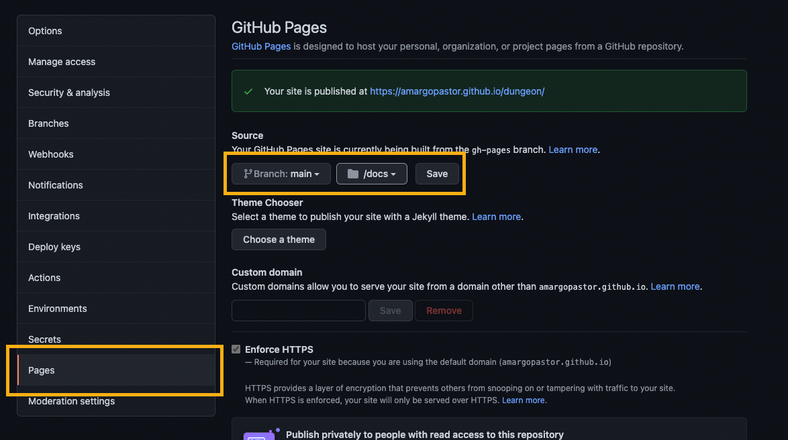
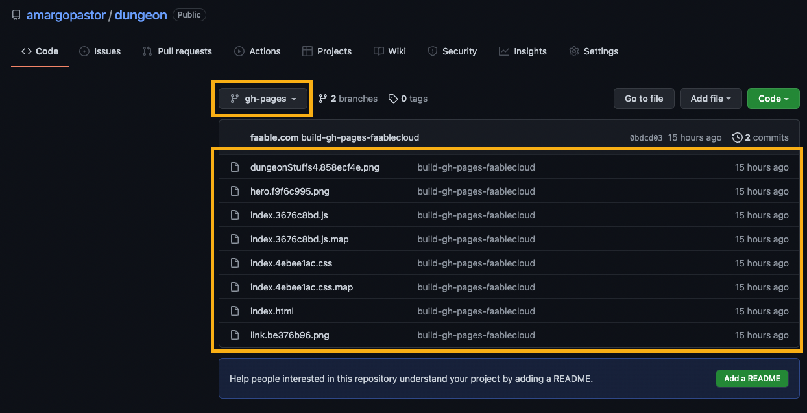
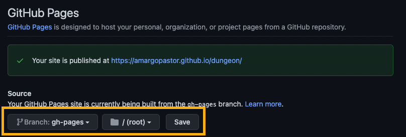
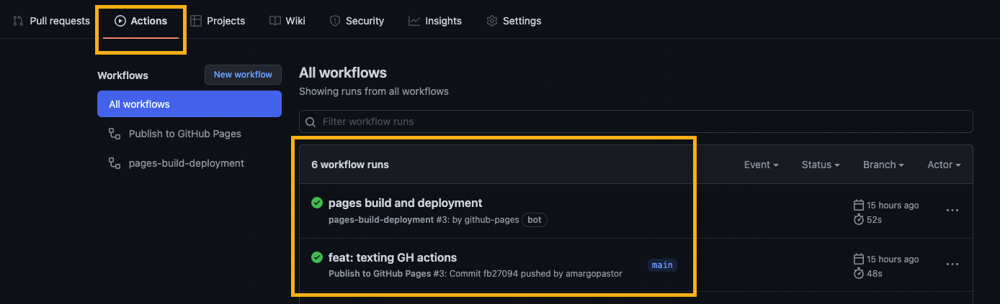

# Web Development FullStack: Mid Project

## Minimum requirements

1. El juego estará desarrollado en [HTML Canvas Graphics Juego](https://www.w3schools.com/html/html5_canvas.asp)
2. Trabajaremos sobre un entorno de [Node.js](https://nodejs.org/es/)
3. Deberemos incluir las `instrucciones` o descripción del objetivo del juego
4. Tomará como modelos los proyectos `Pacman` y `Canvas Car` vistos en clase
5. El `50%` de nuestros ficheros, mínimo, estarán en formato `Typescript`
6. Está permitido el uso de librerias de utilidades como: `lodash`, `ramda`, `luxon` o `momentjs`
7. El usuario debe poder `interactuar` con el juego mediante la detección de acciones sobre las teclas del teclado
8. El juego debe poseer un indicador de rendimiento en `cuadros por segundo(fps)`
9. Quedará registrado un evento durante el flujo normal del juego en el momento en que dos o más actores `colisionen`

## Set-up

1. Emplearemos [Vite](https://vitejs.dev) como el paquete de yarn que nos permitirá ejecutar el front
2. Instalar `npm` o `yarn` como gestores de paquetes, preferible `yarn`

## README.md

El archivo `README.md` es la documento más importante a la hora de aproximar a terceras personas a tu proyecto. Te recomendamos que conste de:

- Título
- Indicación de las tecnologías empleadas
- Imágenes y vídeos
- Motivación del proyecto
- Estructura del proyecto
- Acceso directo al juego
- Tabla de contenidos o índice
- Manual de instalación y deployment
- Ejemplos de código
- Entornos de ejecución
- Variables globales
- Listado de paquetes y dependencias
- Estadísticas
- Licencias
- Agradecimientos
- Otras consideraciones

Elabora un buen `README.md` con la siguiente [documentación](https://www.markdownguide.org/basic-syntax/). `README.md` destacados de antiguos alumnos de CORE Code School:

- [CyberPong](https://github.com/Systrent/CyberPong)
- [PimPamShootIt](https://github.com/AlfonsoValle/PimPamShootIt)
- [PokemonRush](https://github.com/luiscaboc/luiscabocastro-PokemonRush)
- [lola](https://github.com/alesanmed/lola)
- [scout-soccer-project](https://github.com/stevenmontoya/scout-soccer-project)
- [fastapi](https://github.com/stevenmontoya/fastapi)

# GitHub

Para un correcto seguimiento el proyecto la gestión del mismo estará integramente realizada desde GitHub. Para ello emplearemos las secciones de `issues`, `milestones`, `labels` y `projects`. Todos los proyectos deberán constar de:

- Dos ramas principales: `main` y `develop`
- Todas las acciones del proyecto quedarán correctamente identificadas en una issue (desarrollos, bugs, documentación...)
- Todas las issues estarán `estimadas` según las labels de energy
- Todas las issues estarán correctamente `etiquetadas` (energy, bug, documentatios, question, etc)
- Siempre que sea posible, se emplearán los templates de issues `Bug report` y `Feature request` facilitados por GitHub
- Todos los repositorios contarán un proyecto que gestionará el avance de los trabajos
- De manera opcional se pueden subdividir la organización de objetivos en `milestones`

## Specific labels

| Name          | Descriptions                     | color   |
| ------------- | -------------------------------- | ------- |
| report        | daily project tracking           | #DE874C |
| epic          | milestone issue                  | #0321E2 |
| zero-energy   | 30 minute effort                 | #B1BF22 |
| low-energy    | 2 hours effort                   | #FB6942 |
| middle-energy | 5 hours effort                   | #135DE3 |
| high-energy   | 8 hours effort                   | #A932F7 |
| bug           | Something isn't working          | #d73a4a |
| help wanted   | Extra attention is needed        | #008672 |
| question      | Further information is requested | #d876e3 |

## Deploy

1. Desplegar el juego en GitHub Pages compilandolo con `Vite`
1. Completar los campos `Description` y `Website` del repositorio en GitHub
1. Entregar el juego en GitHub pages: `<usuario>.github.io/<repositorio>`. Consulta la [documentación](https://docs.github.com/en/pages/getting-started-with-github-pages/configuring-a-publishing-source-for-your-github-pages-site)

## Typescript on GitHub Pages

Para poder desplegar nuestro proyecto que contiene `TypeScript` en GitHub Pages debemos compilar nuestro código y añadirlo a la carpeta `/docs`:

### Vite

Agregamos un `script` llamado `ghbuild` que ejecutaremos y nos generará la carpeta `/docs`
- `--outDir`: pasaremos el nombre de la carpeta en donde se compilará nuestro proyecto
- `--base`: pasaremos el nombre del repositorio en donde este nuestro proyecto, en este caso usamos `/dungeon` 

```JSON
 "scripts": {
    "dev": "vite", // Ejecutamos nuestro proyecto en local
    "ghbuild": "vite build --outDir docs --base=/dungeon", // Compila todo nuestro código TS y añade a la carpeta DOCS los JS, public files e index.html
    
  },
```

### Parcel (en caso que se utilice)

Agregamos un `script` llamado `ghbuild` que ejecutaremos y nos generará la carpeta `/docs`
- `--dist-dir`: pasaremos el nombre de la carpeta en donde se compilará nuestro proyecto
- `--public-url`: pasaremos el nombre del repositorio en donde este nuestro proyecto, en este caso usamos `/dungeon` 

```JSON
 "scripts": {
    "dev": "parcel index.html", // Ejecutamos nuestro proyecto en local
    "ghbuild": "parcel build --dist-dir docs --public-url /dungeon index.html", // Compila todo nuestro código TS y añade a la carpeta DOCS los JS, public files e index.html
    
  },
```

De ahora en adelante, siempre que ejecutemos `yarn run ghbuild` generaremos una nueva versión de nuestro proyecto en la carpeta `/docs` listo para ser ejecutado desde GitHub Pages:



## GitHub Actions

Para completar el paso anterior podemos implementar nuestra propia GitHub Action. Para ello debemos crear (si no existe previamente) la carpeta `.github` y dentro otra carpeta llamada `workflows`. En esta última añadiremos el siguiente fichero `deploy-gh-pages.yaml`:

```yaml
name: Publish to GitHub Pages
on:
  push:
    branches:
      - main
jobs:
  publish:
    runs-on: ubuntu-latest
    steps:
      - name: Check out
        uses: actions/checkout@v2
      - name: Install dependencies
        run: yarn install
      - name: Build your repo
        run: yarn run build
      - name: Deploy to GitHub Pages
        uses: faablecloud/action-deploy-gh-pages@main
        with:
          dir: docs
          branch: gh-pages
          token: ${{ secrets.GITHUB_TOKEN }}
```

Y listo: de ahora en adelante no es necesario acordarser de hacer un build ya que nuestro proyecto automáticamente ejecutará los comandos anteriormente listados y generará una nueva rama en nuestro repositorio con el proyecto compilado.

> **TIP 1:** Modifica el código si empleas npm como tu gestor de paquetes por defecto.

> **TIP 2:** Si empleas GitHub Actions puedes incluir `docs` y `dist` en tu fichero `.gitignore`. Ya no es necesario duplicar el código compilado: de ahora en adelante este sólo exisitirá en la rama `gh-pages`.





## Mandatory slides

El alumno deberá responder a las siguientes cuestiones en el `README.md` del proyecto o nombrarlas brevemente en la presentación:

1. ¿Qué te ha llevado a elegir este proyecto?
2. ¿Cuál ha sido el mayor problema al que me he enfrentado durante el desarrollo?
3. ¿Cuál es el mayor reto técnico por solucionar en el código?
4. Si empezara de cero ¿Cómo enfocaría o organizaría mi proyecto?
5. ¿Con qué tecnologías o herramientas te has encontrado más cómodo y porqué?

## Presentation rules

- El objetivo de la presentación es ver una demo funcional del proyecto en producción
- Cada alumno dispondrá de **10 minutos máximo** para su presentación más 3 minutos adicionales de preguntas
- La exposición de compondrá de:
  1. Presentación del achivo `README.md`
  1. Detalle de las issues y fórmulas de trabajo (retos, hitos, major fixes...)
  1. Demostración del juego en producción (desde github pages)
  1. Detalle de las partes destacadas del código fuente.
  1. Otros

## Evaluation

Los siguientes puntos serán tenidos en cuenta para la nota final:

- Tiempo de la presentación
- Despliegue en producción
- Exposición clara de los objetivos del juego y vista completa del mismo
- Exposición clara de las partes destacadas del código fuente
- Preparación previa de la exposición por parte del alumno
- Limpieza, legibilidad y ordenación del código fuente
- `README.md` y documentación
- El correcto seguimiento del proyecto mediante las herramientas de GitHub
- Calidad de las issues y etiquetado

## Project ideas

- Pacman
- Carreras de coches
- Tetris
- Snake, la del nokia 3310
- Space Invaders
- Esquivar obstaculos (al estilo temple run)
- Pong
- Super Mario / Juego de plataformas
- Juego del dinosaurio sin conexión (Google)
- Versión simplificada del "Pinball"
- Descubrir parejas de cartas
- Simon Says
- Flappy Bird

## References and inspiration

- [threejs.org](https://threejs.org/)
- [poki.com](https://poki.com/)
- [zone](https://dos.zone/es)
- [pcjs](https://www.pcjs.org/)
- [skoppe.github.io](https://skoppe.github.io/spasm/examples/underrun/)
- [js13kgames.com](https://js13kgames.com/entries/q1k3)
- [emulatorgames.online](https://emulatorgames.online/)
- [gamerpower.com](https://www.gamerpower.com/giveaways/pc)
- [bruno-simon.com](https://bruno-simon.com/)
- [blender.org](https://www.blender.org/)
- [funhtml5games](https://funhtml5games.com/)

## Tools

- [markdownguide.org](https://www.markdownguide.org/cheat-sheet/)
- [avatarsinpixels.com](https://www.avatarsinpixels.com/)
- [sanderfrenken](https://sanderfrenken.github.io/Universal-LPC-Spritesheet-Character-Generator/#?body=Boarman_boarman&sex=muscular&shadow=Shadow_shadow&legs=Wide_pants_white&weapon=Slash_pickaxe)
- [shields.io](https://shields.io/)
- [melody-generator](https://dopeloop.ai/melody-generator/?s=7021990475815574)
- [twistedwave](https://twistedwave.com/online)
- [storyblocks](https://www.storyblocks.com/)

## Repositories

- https://github.com/Systrent/CyberPong
- https://github.com/AlfonsoValle/PimPamShootIt
- https://github.com/luiscaboc/luiscabocastro-PokemonRush
- https://github.com/alexconba/Core-Marc-Rae-Rally
- https://github.com/core-school/pacman
- https://github.com/recuera/puzzle-bobble
- https://github.com/amargopastor/dungeon
- https://github.com/Miguel-Rey/Iron-Rush